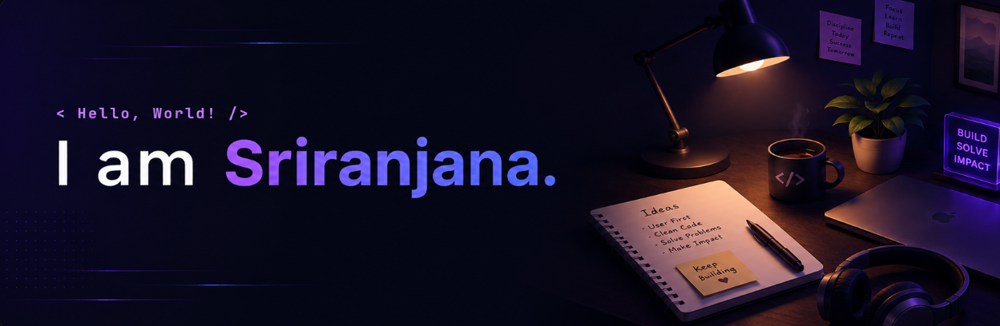

  

Building practical software, scalable web applications, and intelligent AI solutions that solve real-world problems.

---

### 👋 About Me

🎓 Final-year Computer Science (AI) student at **Amrita Vishwa Vidyapeetham** and **Data Science** student at **IIT Madras**, with hands-on experience and a strong interest in building practical software and AI solutions for real-world problems.

🌱 Currently learning **React JS** and **System Design**.

### 💡 Interests

- Full Stack Development
- AI Applications
- Frontend Development

---

### Skills

<table>
<tr>
<td width="180"><b>Languages</b></td>
<td>

</td>
</tr>

<tr>
<td><b>Web Development</b></td>
<td>

</td>
</tr>

<tr>
<td><b>AI & ML</b></td>
<td>

</td>
</tr>

<tr>
<td><b>Databases</b></td>
<td>

</td>
</tr>

<tr>
<td><b>Tools & Platforms</b></td>
<td>

</td>
</tr>

</table>

---

### 🤝 Let's Connect

<a href="https://www.linkedin.com/in/YOUR_LINKEDIN/">
 LinkedIn
</a>

  

<a href="https://YOUR_PORTFOLIO_URL">
🌐 Portfolio
</a>

  

<a href="mailto:sriranjanac@gmail.com">
📧 sriranjanac@gmail.com
</a>

---

### Have a nice day! ✨

